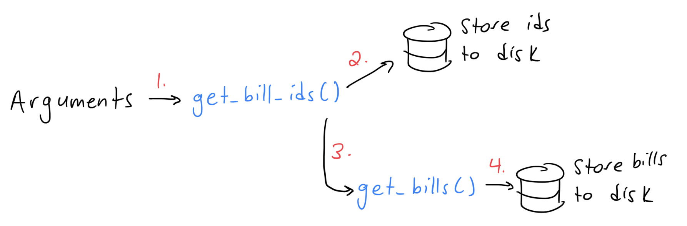

# Congressional Bills Pipeline

The [GovInfo](https://www.govinfo.gov/) site provides access to U.S. government information and documents to the public. This project focuses specifically on accessing and downloading [Congressional Bills](https://www.govinfo.gov/app/collection/bills). GovInfo provides an [API](https://api.govinfo.gov/docs/), which allows developers to request bills (and accompanying information) programmatically. This could be valuable for a number of use cases. For example, if a user is interested in all Senate bills from the 116th Congress (years 2019-2020), they could access those bills via the API. Projects could include natural language processing and/or machine learning techniques to determine which bills are likely to pass/fail and become law. Alternative projects could include sorting and filtering bills based on keywords such as 'climate' or 'reproductive health'. Such projects are dependend on the acquisition and storage of the 240,000+ available bill texts, which is the focus of this project.

## Dependencies

In order to run the Congressional Bills pipeline, a version of Python 3 must be installed on your machine. Visit [Python's documentation](https://www.python.org/downloads/) to download the latest Python version for your machine. I worked in Python 3.9.12 for this project.

The pipeline requires the following modules. These modules are built into [Python's standard library](https://docs.python.org/3/library/) (no need to install if Python 3 is already installed on your machine):
- sys
- json
- math
- os.path

Additionally, the pipeline requires the installation of the [requests library](https://pypi.org/project/requests/). Installation step included in the [How to run](https://github.com/morden35/bill_pipeline#how-to-run) section of this document.

## How to run

First, clone and navigate to this repository:\
`$ git clone git@github.com:morden35/bill_pipeline.git`\
`$ cd bill_pipeline/`

Next, install the required libraries:\
`$ pip install -r requirements.txt`

The pipeline takes in 4 optional arguments:
- num_bills - The number of bill texts to retrieve (default 25, max 999)
- congress - congress number (default 116), (options include 103-117)
- docClass - bill category (defaut s), (options include: s, hr, hres, sconres)
- billVersion - bill version (default is), (there are 53 possible version types, listed in [bills.py](https://github.com/morden35/bill_pipeline/blob/main/bills.py) file)

To run the pipeline, run the following from the command line:\
`$ python3 bills.py <num_bills> <congress> <docClass> <billVersion>`

## Pipeline description

 \
This pipeline is relatively simple and is made up of 2 functions, get_bill_ids() and get_bills().

### get_bill_ids()

In order to request and download bill texts from the GovInfo API, we first need to know the bill ids (aka 'packageID') of interest. The goal of get_bill_ids() is to retrieve the bill ids of interest from the API before calling get_bills(). It does so through the following steps:

- Take in the user provided argments (if any) and check if those arguments are valid.
- Check if the file with the bill ids of interest is already saved to disk as to avoid extra API calls.
- If the file already exists, call get_bills().
- If the file with the bill ids does not exists, make a request to the GovInfo API \/collections endpoint.
- If the request succeeds, save the bill ids to disk and call get_bills().
- If the request fails, return the status code.

### get_bills()

Once we have a file containing the bill ids of interest, we can finally get the bill texts of interest. get_bills() does so through the following steps:

- Open and read the file contents.
- Retrieve the bill ids of interest and the number of total bills.
- For each bill id, check that the bill text is not already saved to disk as to avoid extra API calls.
- If the bill text is already saved, move on to the next bill id.
- If the bill text is not already saved, make a request to the GovInfo API \/packages endpoint.
- If the request succeeds, save the bill text (.pdf) to disk.
- If the request fails, return the status code.

## Data Schema

The retrieved bill id files and bill text files are saved locally to disk. In this repository, you will find a [\/data](https://github.com/morden35/bill_pipeline/tree/main/data) folder. The \/data folder contains two additional folders, [\/ids](https://github.com/morden35/bill_pipeline/tree/main/data/ids) and [\/bills](https://github.com/morden35/bill_pipeline/tree/main/data/bills). Id files and bill text files are stored using the following paths:

data\/ids\/<congress>\/<congress>\_<docClass>_<billVersion>.json \
data\/bills\/<congress>\/<bill_id>.pdf

## Future Work

1. Parallelization

The main challenge of downloading bill texts in bulk is that the GovInfo API has a maximum request limit of 1000 requests per hour per API key. In the future, I would like to handle this issue through the use of parallelization. For a given user request, we can divide the total number of bills by 1000 to determine the number of API keys and machines needed to download all of the bills of interest. Technologies such as Dask, Spark, and/or cloud computing services could be used to accomplish this.

2. More Robust Storage

At the moment, bill ids and bill texts (pdf) are store locally in the \/data\/ids\/ and \/data\/bills\/ folders respectively. This is fine for smaller scale projects, however it is not ideal to store large number of bill texts on a user's local machine. If a user was interested in doing analyses on all available bill texts (+240,000), a more robust storage solution would be needed. [Previous iterations of this project](https://github.com/morden35/bills_nlp_large_scale) used AWS S3 buckets to store bill texts. S3 buckets are ideal for storing large unstructured data (e.g. text files, images, video, etc), so they could be a good solution for this issue.

3. More Robust Input Checks

At the moment, I am doing some simple checks to see if the user provided arguments are valid individually. However, these checks could be more robust and take into account different combinations of user input. For example, providing the docClass 's' and billVersion 'ath' is not a valid combination as 's' refers to Senate Bill and 'ath' refers to bills agreed to by the House (see [About Congressional Bills](https://www.govinfo.gov/help/bills#about) for complete list of abbreviations). Requests with invalid combinations of arguments will result in zero bill ids and zero bill texts. It would be nice to catch these invalid combinations and print a more informative error to the user.

4. More Robust Error Handling

I am currently wrapping my GovInfo API requests in try\/except blocks. If a request fails, I return 500 error codes. More detailed error messages could be provided to users in the future based on the potential [GovInfo Error Messages](https://github.com/usgpo/api#error-messages).

## Citations

This pipeline was adapted from a previous project: https://github.com/morden35/bills_nlp_large_scale \
https://api.govinfo.gov/docs/ \
https://github.com/usgpo/api
https://www.govinfo.gov/help/bills#about